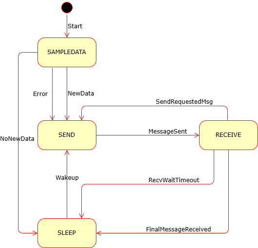

# LORA Protocol Design
This is the protocol used by the LORA nodes. It will handle:
- Sensor data updates
- Nodes status reporting
- Sensor node configuration

## Overview

The **LORA system** consists of one gateway and a number of sensor nodes. The gateway is responsible for the following:
- Collecting data from the sensor nodes
- Publishing data to the MQTT broker
- Receiving commands from the backend
- Keeping track of sensor node health and report that to the backend system

The **sensor nodes** are responsible for the following:
- Collecting data from the sensors
- Receiving commands from the gateway
- Keeping track of their own health and report that to the gateway

## Protocol Structure
The protocol is based on JSON messages.
- Each message is a JSON object.
- All JSON keys are lowercase and only one character.
- There are no timestamps in the messages since there is no RTC on the sensor nodes.

A message has the following fields:
```
{
   "i" : "message id",
   "s" : "source address",
   "d" : "destaddress Or Broadcast",
   "t" : "type of message"
   "m" : "actual message"
}
```

- The **message id** (i) is a unique identifier for the message. It is a 32 bit number. It's just a sequence id that the sender keeps track of.
- The **destination address** (d) is a 32 bit number. It is used to identify the recipient of the message. If the destination address is "Broadcast" the message is sent to all nodes. The gateway always has id 1 and a broadcast message has id 0. The sensor nodes have a unique id based on the MAC address.
- The **message type** (t) is a character. It is used to identify the type of the message. Valid types are:
  - "I" for "I'm here" message
  - "A" for "Acknowledge" message (used to confirm receipt of a message)
  - "C" for "Config" message (used to configure the sensor node hence sent from gateway to sensor nodes)
  - "R" for "Report" message (used to report the status of the sensor node)
  - "D" for "Data" message (used to send sensor data)
- The **actual message** (m) is a JSON object. It is used to carry the data of the message. The format of m is:
  - "I" for "I'm here" message: 
```
{
   "n" : "devicename",
   "t" : "devicetype",
}
```
  - "A" for "Acknowledge" message: 
```
{
   "i" : "message id of the message that is acknowledged",
   "a" : "ack/nack",
   "e" : "any errors",
   "c" : "what to do next", /* optional */
}
```
  - "C" for "Config" message:
```
{
   "s" : "Sleep time in seconds",
   "k" : "Number of boots between heartbeats",
   "dt" : "temperature difference for reporting",
   ...
}
```
  - "R" for "Report" message: 
```
{
   "n" : "devicename",
   "t" : "devicetype",
   "a" : "json object with current status such as battery level, location, etc",
   "s" : "json array with sensor definitions",   
}
```
  - "a" for sensor status json:
```
{
   "l" : device location, /* shore, lake, ... */
   "b" : battery level,
   ...
}
```
  - "s" for sensor definitions json array, one item per sensor:
```
[
  {
   "i" : sensor id, /* device internal sensor  id */
   "l" : sensor location, /* air, water, ground */
   "n" : sensor name, /* e.g. DS18B20 */
   "t" : sensor value type, /*"T","P","H","A", ...*/
   "u" : sensor unit, /*"C","hPA", "%", "m", ... */
   "r" : sensor resolution,
   "a" : sensor accuracy,
   ...
  },
  ...
]
```
  - "D" for "Data" message: 
```
{
   "i" : "sensor id", /* See the Report message above for "i", location and the reported unit
   "t" : "datatype",
   "v" : "data value",
}
```

## Message sequences

Since sensors normally are in sleep mode all message sequences are initiated by sensor nodes. The gateway can initiate a message to the sensor nodes within an acknowledge message using the "c" field. This can be that the sensor shall wait for a message from the gateway, it can be a config message or a request for a report message.



## Sensor node startup sequence

1. Send "I'm here" message to gateway
2. Wait 30 s for an acknowledge from gateway
3. Send "Config" message to gateway
4. Wait 30 s for an acknowledge from gateway
5. Send "Report" message to gateway

## Gateway startup sequence

## Implementation
The protocol is implemented as a c++ libary called LoraSummertime.
