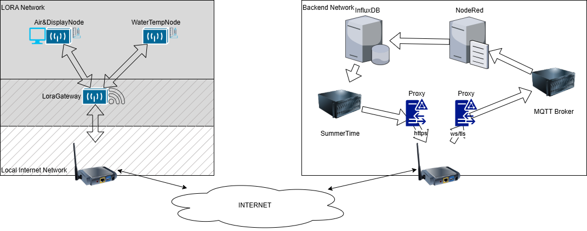

# General idea

- **LORA nodes**:
  - **WaterTempNode**: A LORA based device with a temp sensor is attached near the water.
    - Battery driven
    - Initially try with TTGO LORA32 but this might be too batteryhungry so if possible design based on an ATTiny (or) PIC µP
    - **AIR&DisplayNode**: A LORA based device with temp and humidity sensor.
    - Solarpowered battery driven
    - ...
  - **LORAGateway**: A LORA based device functioning as a gateway between the LORA network and internet. 
    - AC/USB power alternativly Solarbattery
    - Connects to any available WiFi at the LORA node site.
    - Sensordata published to the backen MQTT Broker
    - Historical data back to nodes stored o retrived?
    - Based on a Heltec Wireless Stick V3
    - ...

- **Backend**
  - MQTT Broker: Container deployment of Mosquitto on idefix. Exposed via reverse proxy to the internet. Secured.
  - Automation: Container deployment of Node-Red on idefix. Only reachable within internal network.
  - Database: Container deployment of Influx on idefix. Only reachable within internal network.

- **Frontend**
  - "*SummerTime*": NodeJS Express application deployed on Idefix. Exposed via reverse proxy to the internet. Secured.
    - Start page shows current values watertemp, airtemp, humidity. Date and time of measuremenst. Current location and date and time
    - Possibility to show history of a sensor value.
    - Feedback form



## InfluxDB

## MQTT setup

- Base topic is iot
- site and location are subtopics

MQTT is also used as a node monitoring using the birth and LWT messages.

# LORA devices
## Protocol

The LORA devices communicate with a JSon based protocol as payload.
There are 2 types of messages sensordata and configuration
A message can be broadcasted to all nodes or be directed to one node
All messages shall be acknowledged

```
{
   "mid" : "message id",
   "dst" : "destaddress Or Broadcast",
   "cmd" : "type of message"
   "msg" : "actual message"
}
```

Node keep alive monitoring is done with ...

## WaterTempNode

 [Lilygo TTGO LORA32 V2.1](https://lilygo.cc/products/lora3?srsltid=AfmBOop02ZAt2DNnjyeRxOZtab0ygGJ0dLK-7sXWsq4PshTEKc9ZP_9H).

Features:
- Lora capable
- OneWire for the temp measurements
- Battery powered
- Deep sleep sending measurements every 30 minutes

## LORAGateway

[Heltec Wireless Stick V3](https://heltec.org/project/wireless-stick-v3/).

Features:
